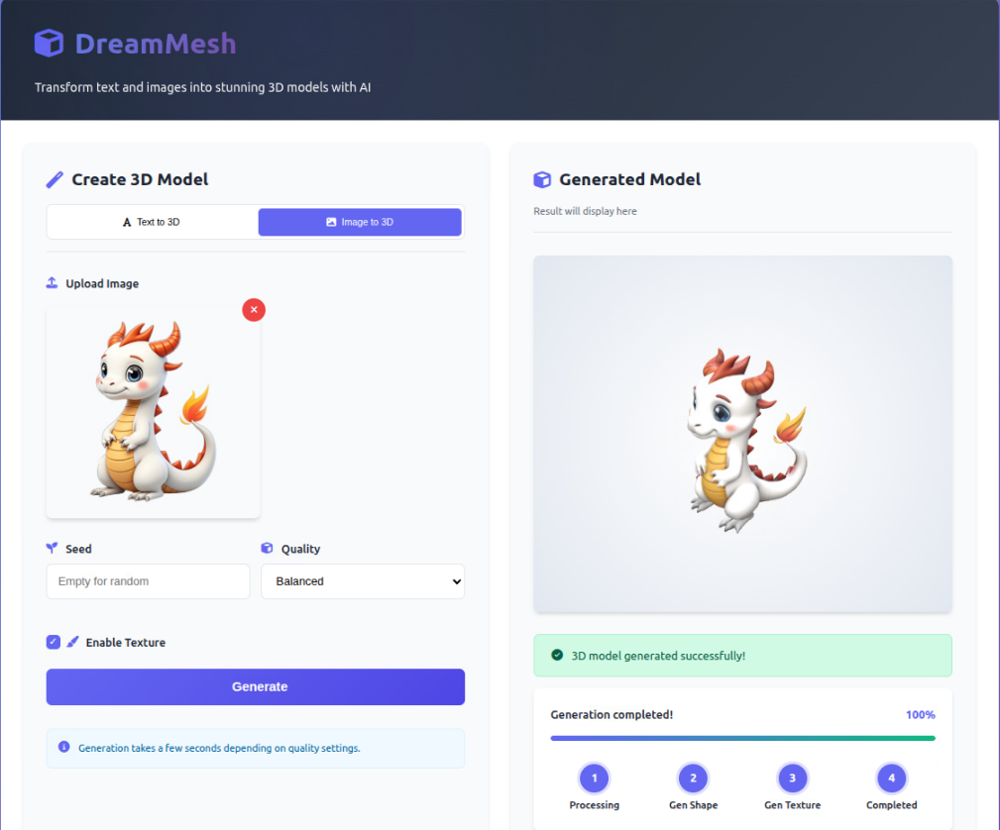

# 🎨 DreamMesh: Production-Ready 3D Generation Server



**DreamMesh** is a high-performance 3D generation wrapper built on the **Hunyuan3D-2** engine. It provides a robust **FastAPI-based server** and an **interactive visualization UI** to transform text and images into high-fidelity 3D assets.

---

## ✨ Enhancements over Hunyuan3D-2
* 🚀 **RESTful API**: Fully documented Swagger/OpenAPI endpoints for remote generation.
* 📊 **Real-time Visualization**: Integrated web-based 3D viewer to inspect meshes before downloading.
* ⚡ **Asynchronous Task Queue**: Handles multiple generation requests without blocking the server.
* 🛠 **Extended PBR Support**: Enhanced texture synthesis with Albedo and Roughness maps.

---

**GPU Recommendation**: NVIDIA GPU with 24GB+ VRAM (e.g., RTX 3090/4090)

## 🚀 Quick Start

### 1. Create conda environment
```bash
conda create -n hunyuan3d python=3.10 -y
conda activate hunyuan3d
```

### 2. Install dependencies
```bash
pip install -r requirements.txt
pip install -e .
# for texture
cd hy3dgen/texgen/custom_rasterizer
python3 setup.py install
cd ../../..
cd hy3dgen/texgen/differentiable_renderer
python3 setup.py install
```

### 3. Run API Server
```bash
docker compose up -d
```

**Check logs**
```bash
docker compose logs -f
```

### 4. Open Web UI
```bash
cloudflared tunnel --url http://0.0.0.0:8081
```

## 📜 Acknowledgments

**This project is built upon the incredible foundation provided by the [](https://github.com/Tencent-Hunyuan/Hunyuan3D-2)**
